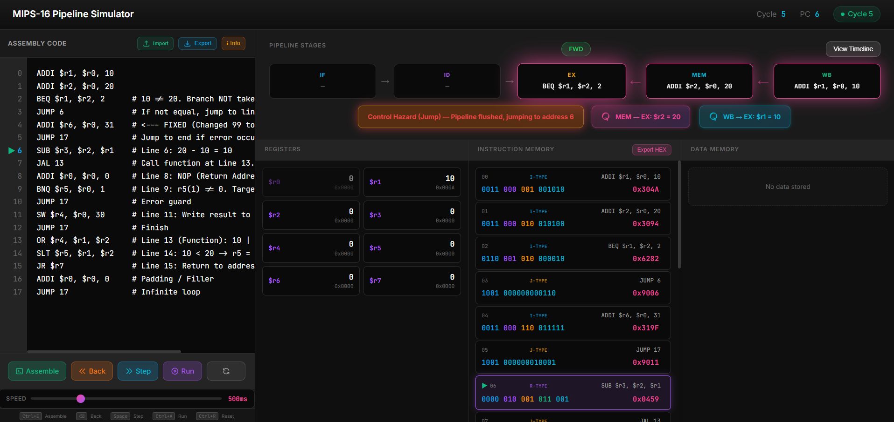
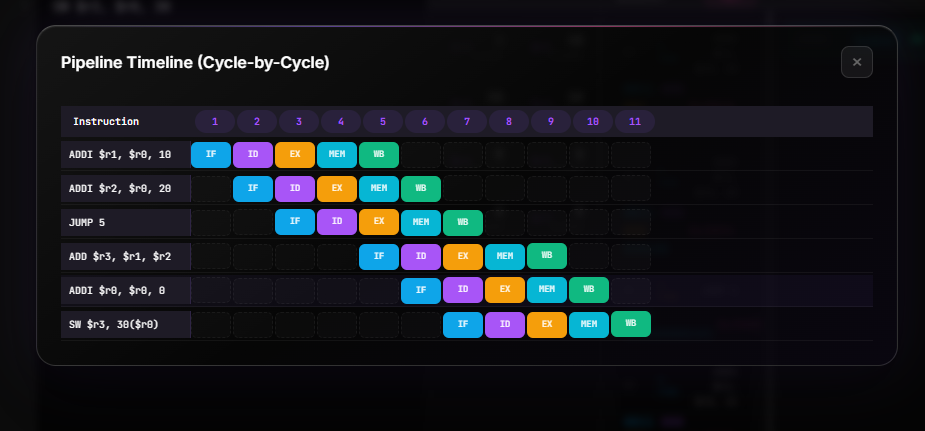
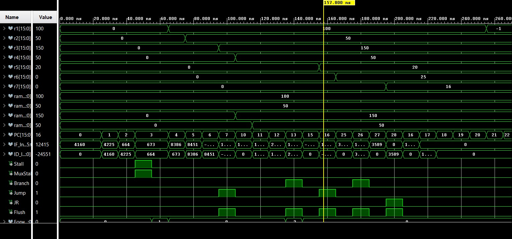
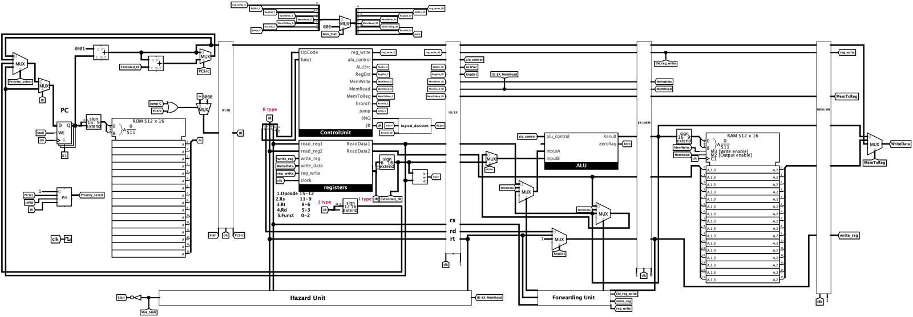

<p align="center">
  
  
  
  
  
</p>

<h1 align="center">🚀 AURA16</h1>
<h3 align="center">16-Bit MIPS Pipeline Processor</h3>

<p align="center">
  <b>A complete educational processor design with hardware simulation, HDL implementation, and interactive web-based simulator.</b>
</p>

---

## 📋 Table of Contents

- [Overview](#-overview)
- [Architecture](#-architecture)
- [Instruction Set Architecture (ISA)](#-instruction-set-architecture-isa)
- [Pipeline Stages](#-pipeline-stages)
- [Hazard Handling](#-hazard-handling)
- [Project Structure](#-project-structure)
- [Web Simulator](#-web-simulator)
- [Verilog Implementation](#-verilog-implementation)
- [Logisim Design](#-logisim-design)
- [Getting Started](#-getting-started)
- [Contributors](#-contributors)

---

## 🎯 Overview

**AURA16** is a complete 16-bit MIPS-style pipelined processor designed for educational purposes. It includes:

| Component | Description |
|-----------|-------------|
| 🔧 **Logisim Circuit** | Visual hardware design for understanding datapath |
| 📝 **Verilog HDL** | Synthesizable RTL code for FPGA implementation |
| 🌐 **Web Simulator** | Interactive Django-based simulator with step-by-step execution |

---

## 🏗 Architecture

### CPU Specifications

| Feature | Specification |
|---------|---------------|
| **Word Size** | 16-bit |
| **Registers** | 8 general-purpose ($r0-$r7, $r0 always 0) |
| **Instruction Memory** | 512 words |
| **Data Memory** | 512 words |
| **Pipeline Depth** | 5 stages |
| **Hazard Resolution** | Forwarding + Stalling |

### Block Diagram

```
┌───────────────────────────────────────────────────────────┐
│                           5-Stage MIPS Pipeline           │
├───────────┬───────────┬───────────┬───────────┬───────────┤
│    IF     │    ID     │    EX     │    MEM    │    WB     │
│  Fetch    │  Decode   │  Execute  │  Memory   │ WriteBack │
├───────────┼───────────┼───────────┼───────────┼───────────┤
│ Instr Mem │ Reg File  │   ALU     │ Data Mem  │   Mux     │
│    PC     │ Control   │ Fwd Unit  │           │           │
│           │ Sign Ext  │           │           │           │
└───────────┴───────────┴───────────┴───────────┴───────────┘
         │           │           │           │
         └─────────────── Pipeline Registers ───────────────┘
              IF/ID       ID/EX       EX/MEM      MEM/WB
```

---

## 📚 Instruction Set Architecture (ISA)

### Instruction Formats

```
R-Type: | OpCode(4) | Rs(3) | Rt(3) | Rd(3) | Funct(3) |
I-Type: | OpCode(4) | Rs(3) | Rt(3) |    Immediate(6)  |
J-Type: | OpCode(4) |          Address(12)             |
```

### R-Type Instructions (OpCode: 0000)

| Instruction | Funct | Syntax | Description |
|-------------|-------|--------|-------------|
| `ADD` | 000 | `ADD $rd, $rs, $rt` | rd = rs + rt |
| `SUB` | 001 | `SUB $rd, $rs, $rt` | rd = rs - rt |
| `AND` | 010 | `AND $rd, $rs, $rt` | rd = rs & rt |
| `OR`  | 011 | `OR $rd, $rs, $rt`  | rd = rs \| rt |
| `SLT` | 100 | `SLT $rd, $rs, $rt` | rd = (rs < rt) ? 1 : 0 |
| `JR`  | 101 | `JR $rs`            | PC = rs |

### I-Type Instructions

| OpCode | Instruction | Syntax | Description |
|--------|-------------|--------|-------------|
| 0001 | `LW`   | `LW $rt, imm($rs)`    | rt = Mem[rs + imm] |
| 0010 | `SW`   | `SW $rt, imm($rs)`    | Mem[rs + imm] = rt |
| 0011 | `ADDI` | `ADDI $rt, $rs, imm`  | rt = rs + imm |
| 0100 | `SUBI` | `SUBI $rt, $rs, imm`  | rt = rs - imm |
| 0101 | `SLTI` | `SLTI $rt, $rs, imm`  | rt = (rs < imm) ? 1 : 0 |
| 0110 | `BEQ`  | `BEQ $rs, $rt, offset`| if (rs == rt) PC = PC + 1 + offset |
| 0111 | `BNQ`  | `BNQ $rs, $rt, offset`| if (rs != rt) PC = PC + 1 + offset |
| 1000 | `ANDI` | `ANDI $rt, $rs, imm`  | rt = rs & imm |

### J-Type Instructions

| OpCode | Instruction | Syntax | Description |
|--------|-------------|--------|-------------|
| 1001 | `JUMP` | `JUMP address` | PC = address |
| 1010 | `JAL`  | `JAL address`  | $r7 = PC + 1, PC = address |

---

## 🔄 Pipeline Stages

### Stage Details

| Stage | Name | Operations |
|-------|------|------------|
| **IF** | Instruction Fetch | Fetch instruction from memory, PC = PC + 1 |
| **ID** | Instruction Decode | Decode opcode, read registers, sign extend immediate, branch decision |
| **EX** | Execute | ALU operations, address calculation, forwarding |
| **MEM** | Memory Access | Load/Store data memory access |
| **WB** | Write Back | Write result back to register file |

### Pipeline Registers

```
IF/ID Register:
├── PC_Adder (16-bit)
└── Instruction (16-bit)

ID/EX Register:
├── Control Signals (reg_write, ALUSrc, RegDst, MemWrite, MemRead, MemToReg)
├── PC_Adder, ReadData1, ReadData2 (16-bit each)
├── Rs, Rt, Rd (3-bit each)
└── Immediate (16-bit sign-extended)

EX/MEM Register:
├── Control Signals (reg_write, MemWrite, MemRead, MemToReg)
├── ALU_Result, ReadData2 (16-bit each)
└── WriteReg (3-bit)

MEM/WB Register:
├── Control Signals (reg_write, MemToReg)
├── ALU_Result, MemData (16-bit each)
└── WriteReg (3-bit)
```

---

## ⚡ Hazard Handling

### Data Hazards (RAW)

| Hazard Type | Detection | Resolution |
|-------------|-----------|------------|
| **EX Hazard** | EX/MEM.rd = ID/EX.rs or rt | Forward from EX/MEM |
| **MEM Hazard** | MEM/WB.rd = ID/EX.rs or rt | Forward from MEM/WB |
| **Load-Use** | ID/EX.MemRead && (ID/EX.rt = IF/ID.rs or rt) | Stall 1 cycle |

### Control Hazards

| Hazard Type | Resolution |
|-------------|------------|
| **Branch** | Early branch decision in ID stage, flush IF/ID on taken branch |
| **Jump/JAL** | Flush IF/ID, JAL continues through pipeline for $r7 write |
| **JR** | Forward register value, flush pipeline |

### Forwarding Paths

```
                    ┌─────────────────────────────────────┐
                    │         Forwarding Unit             │
                    │  ┌─────────────────────────────┐    │
                    │  │  ForwardA: 00=RF, 10=EX/MEM │    │
                    │  │            01=MEM/WB        │    │
                    │  │  ForwardB: Same as above    │    │
                    │  └─────────────────────────────┘    │
                    └─────────────────────────────────────┘
                                    │
    ┌───────────┐     ┌───────────┐ │ ┌───────────┐     ┌───────────┐
    │    ID     │────▶│    EX     │◀┘▶│    MEM    │────▶│    WB     │
    └───────────┘     └───────────┘   └───────────┘     └───────────┘
                           ▲               │                  │
                           └───────────────┴──────────────────┘
                                    Forwarding Paths
```

---

## 📁 Project Structure

```
AURA16/
├── 📂 Logisim/
│   └── MIPS_LastVers.circ        # Complete Logisim Evolution circuit
│
├── 📂 Verilog/
│   ├── MIPS_Pipeline.v           # Top-level module
│   ├── tb_MIPS_Pipeline.v        # Testbench
│   │
│   ├── # Pipeline Registers
│   ├── IF_ID_Register.v
│   ├── ID_EX_Register.v
│   ├── EX_MEM_Register.v
│   ├── MEM_WB_Register.v
│   │
│   ├── # Datapath Components
│   ├── ProgramCounter.v
│   ├── InstructionMemory.v
│   ├── RegisterFile.v
│   ├── ALU.v
│   ├── DataMemory.v
│   ├── SignExtend.v
│   ├── WB_Mux.v
│   │
│   ├── # Control Unit
│   ├── ControlUnit.v
│   ├── StallMux.v
│   │
│   ├── # Hazard Handling
│   ├── HazardUnit.v
│   ├── ForwardingUnit.v
│   ├── ID_ForwardingControl.v
│   ├── ID_ForwardingMux.v
│   │
│   └── # Branch Logic
│       ├── Comparator.v
│       └── BranchDecision.v
│
└── 📂 Simulator/
    ├── manage.py
    ├── requirements.txt
    │
    ├── 📂 mips_simulator/        # Django project settings
    │   ├── settings.py
    │   ├── urls.py
    │   └── wsgi.py
    │
    └── 📂 simulator/             # Main application
        ├── views.py              # API endpoints
        ├── cpu.py                # CPU simulator (5-stage pipeline)
        ├── assembler.py          # Assembly to machine code
        ├── 📂 templates/
        │   └── index.html        # Web interface
        └── 📂 static/
            ├── css/styles.css    # UI styling
            └── js/main.js        # Frontend logic
```

---

## 🌐 Web Simulator

### Features

- ✅ **Assembly Editor** - Write MIPS assembly code with syntax highlighting
- ✅ **Assembler** - Convert assembly to 16-bit machine code
- ✅ **Step Execution** - Execute one cycle at a time
- ✅ **Run All** - Execute until completion
- ✅ **Pipeline Visualization** - See all 5 stages in real-time
- ✅ **Register File Display** - Monitor all 8 registers
- ✅ **Memory View** - Inspect data memory contents
- ✅ **Hazard Detection** - Visual indicators for stalls/forwarding
- ✅ **Timeline View** - Pipeline diagram showing instruction flow
- ✅ **Performance Metrics** - CPI, stall rate, forwarding rate
- ✅ **Export** - Download machine code in HEX format
- ✅ **Info Button** - Built-in ISA reference guide:
                - Register descriptions ($r0-$r7 with usage info)
                - R-Type, I-Type, J-Type instruction syntax and opcodes
                - 16-bit instruction format diagrams

### Screenshots

#### Simulator Dashboard


#### Pipeline Timeline (Cycle-by-Cycle)


---

## 🛠 Verilog Implementation

### Module Hierarchy

```
MIPS_Pipeline (Top)
├── ProgramCounter
├── IF_ID_Register
├── ControlUnit
├── StallMux
├── RegisterFile
├── SignExtend
├── ID_ForwardingControl
├── ID_ForwardingMux
├── Comparator
├── BranchDecision
├── HazardUnit
├── ID_EX_Register
├── ForwardingUnit
├── ALU
├── EX_MEM_Register
├── DataMemory
├── MEM_WB_Register
└── WB_Mux
```

### Simulation

```bash
# Using Icarus Verilog
cd Verilog
iverilog -o sim tb_MIPS_Pipeline.v MIPS_Pipeline.v *.v
vvp sim

# Using ModelSim
vsim -c -do "run -all" work.tb_MIPS_Pipeline
```

### Waveform Screenshot



---

## 🔌 Logisim Design

The Logisim circuit (`MIPS_LastVers.circ`) provides:

- **Visual Datapath** - Complete processor datapath with all components
- **Interactive Simulation** - Step through clock cycles
- **Signal Inspection** - Probe any wire in the circuit
- **Educational Value** - Understand hardware implementation

### Circuit Screenshot



### Requirements

- [Logisim Evolution](https://github.com/logisim-evolution/) v3.9.0 or later

---

## 🚀 Getting Started

### Web Simulator

```bash
# Clone the repository
git clone https://github.com/BySabri/16-Bit-MIPS-Pipeline-Simulator---AURA16.git
cd 16-Bit-MIPS-Pipeline-Simulator---AURA16/Simulator

# Create virtual environment (optional)
python -m venv venv
source venv/bin/activate  # Linux/Mac
venv\Scripts\activate     # Windows

# Install dependencies
pip install -r requirements.txt

# Run the server
python manage.py runserver

# Open browser
# http://127.0.0.1:8000
```

### Verilog Simulation

```bash
cd Verilog

# Using Icarus Verilog
iverilog -o mips_sim tb_MIPS_Pipeline.v MIPS_Pipeline.v \
    ALU.v ControlUnit.v DataMemory.v RegisterFile.v \
    IF_ID_Register.v ID_EX_Register.v EX_MEM_Register.v MEM_WB_Register.v \
    ForwardingUnit.v HazardUnit.v ID_ForwardingControl.v ID_ForwardingMux.v \
    ProgramCounter.v SignExtend.v StallMux.v WB_Mux.v \
    Comparator.v BranchDecision.v

vvp mips_sim
```

---

## 👨‍💻 Contributors

| Name | Role |
|------|------|
| **BySabri** | Leader - FullStack Web Developer |
| **yasinulky** | Co-leader - Logisim Developer |
| **UniKpec** | Verilog and Backend Developer |
| **Yaraill** | Chief Rubber Duck Debugging Specialist and Documentation |


---

## 📄 License

This project is open source and available under the [MIT License](LICENSE).

---
